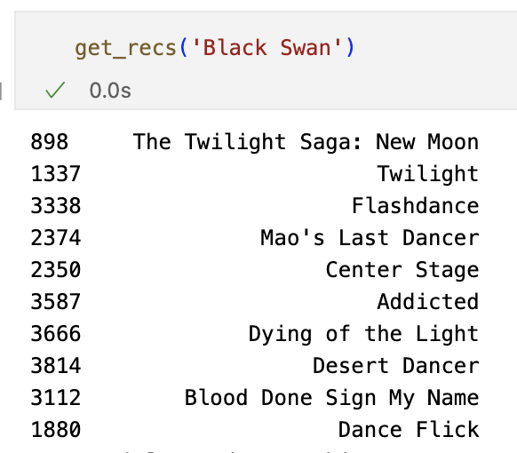
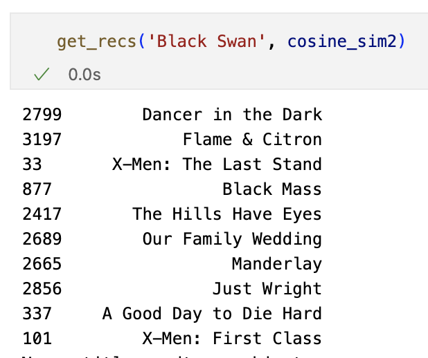

# Movie Recommendation System

Currently a work in progress, updates coming soon :)

# Description
I'm working on building a movie recommendation system based on demographic, content-based, and collaborative filtering. The final goal of this project is to generate age-specific recommendations for users ages in varying age groups, _without_ being given any information about the users themselves. I hope to accomplish this by building on the three difference recommendation systems listed earlier as well as genre analysis and clustering techniques.

This project is done in Python, and will be using the following libraries:
* Pandas
* NumPy
* Matplotlib
* Scikit-learn
* ast (Python module)
* surprise (Python scikit)

Here is a brief overview of each of the three movie recommendation systems.

### 1. Demographic Filtering
Demographic filtering is the most straight-forward of the recommendation systems I will be covering. As the name suggests, it is based solely on user demographics (gender, ethinicity, age, etc.). The general idea is that members belonging to the same groups tend to like the same things - including movies. Obtaining user information, however, can be challenging, and it is something that this dataset lacks. In this case, my demographic filtering is somewhat broad and will be based on the average review and the number of review that each movie is given, rather than specific user groups. This is similar to how streaming services like Netflix suggest "Top 10 Movies in the US Today". **_The end goal of this project, however, is to recommend movies based on age group - which I aim to do without any direct user information._**

### 2. Content-based Filtering
Content-based filtering recommends similar products based on users' past histories or their direct queries. For instance, people who have watched many action movies  typically like other films of the same genre - or if they prefer watching movies in a specific collection, or with certain actors or directors, or even user-entered keywords into a search bar. This is similar to Netflix's "Because you watched [movie X]" bar. Content-based filtering requires both user and item metadata (movie genre, actors, director, etc).

Here is an example:

You can see that many of the recommendations have some form of the word "dance" in them.

### 3. Collaborative Filtering
Collaborative filtering only requires user metadata, taking into consideration the preferences and behaviors of many users to make recommendations. By analyzing patterns and similarities among users, collaborative filtering suggests new items based on the preferences of other users with similar taste. This is comparable to Netflix's "Others Also Watched" feature.

Here is an example:

The recommendations have changed, becoming more attuned to the likes and dislikes of similar users. New suggestions are shown, whereas in the content-based filtering results, the list of movies was filtered primarily based on the metadata of "Black Swan".

In this project, I will be using a dataset of 5,000 movies from TMBD, linked <a href = "https://www.kaggle.com/datasets/tmdb/tmdb-movie-metadata"> here </a> .
The first csv contains the following information:
- budget, the budget of the movie
- genres, a list of genres corresponding to the movie
- homepage
- id
- keywords
- original_language
- original_title
- overview
- popularity
- production_companies
- production_countries
- release_date
- revenue
- runtime, the runtime of the move in minutes
- spoken_languages
- status
- tagline
- title
- vote_average
- vote_count
- cast
- crew

The second csv file contains:
- movie_id
- title
- cast
- crew
